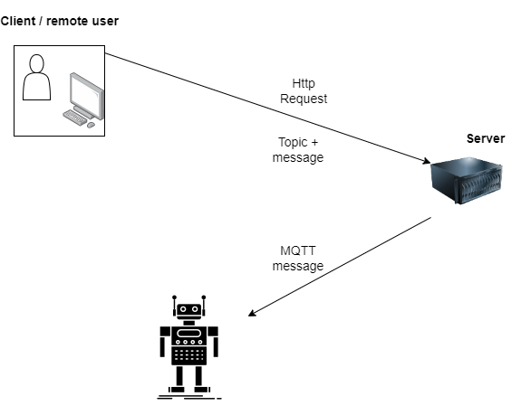

## Server

# A client can use  with a web page and send  HTTP requests ( Node JS part)

# This server is made with python and handle the request with the command then the server send MQTT ordres to the robot

